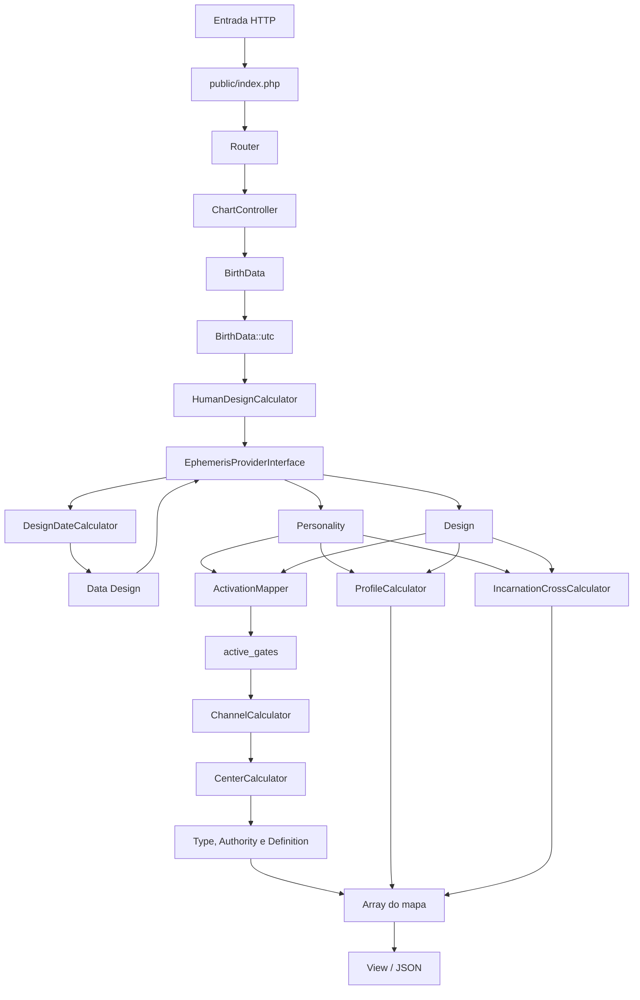

# Arquitetura atual

Este documento descreve a organização existente. Ele não pressupõe uma reorganização futura.

## Fluxo da requisição HTTP

`server.php` encaminha requisições não estáticas para `public/index.php`. A entrada carrega o autoloader, lê `.env`, seleciona um provedor de efemérides, instancia `HumanDesignCalculator`, registra as rotas e executa `Application`. `Router` escolhe o controller; `ChartController` transforma o POST em `BirthData`, solicita o cálculo e entrega o resultado à view. Respostas em array são serializadas por `Response::json`; o cálculo do formulário normalmente é renderizado como HTML.

## Domínio e tempo

`BirthData` valida os campos mínimos, cria um `DateTimeImmutable` no timezone informado e expõe `utc()`. Latitude e longitude são opcionais e encaminhadas ao provedor, embora o comando atual do Swiss Ephemeris não as use. `Activation` é o objeto imutável de saída de uma longitude mapeada, contendo corpo, longitude, gate, line, color, tone e base.

## Provedores de efemérides

`EphemerisProviderInterface` abstrai a obtenção de longitude, o nome do provedor e sua confiabilidade.

- `SwissEphemerisProvider` valida binário e diretório, executa `swetest` via `proc_open`, interpreta uma longitude e a normaliza.
- `DemoEphemerisProvider` gera números determinísticos por hash. É útil para fluxo de interface, mas não é astronômico.
- `StrictEphemerisProvider` lança uma exceção ao tentar calcular; evita resultados inventados sem configuração real.

## Pipeline de cálculo

`HumanDesignCalculator` ainda atua como orquestrador principal. Para Personality, solicita ao provedor 11 corpos e deriva Terra e Nodo Sul. `DesignDateCalculator` encontra o instante anterior cujo Sol está 88° atrás do Sol natal; o mesmo pipeline então produz Design. Cada longitude passa por `ActivationMapper`.

A união ordenada dos gates alimenta:

- `ChannelCalculator`, que identifica pares completos e conhece as ligações entre centros;
- `CenterCalculator`, que reúne os centros tocados por canais completos;
- `TypeCalculator`, que classifica pelo Sacral e pela conectividade de motores à Garganta;
- `AuthorityCalculator`, que aplica uma hierarquia aos centros definidos;
- `DefinitionCalculator`, que conta componentes conectados;
- `ChartIdentityCalculator`, que associa strategy, signature e not-self theme ao tipo;
- `ProfileCalculator`, que combina as linhas dos Sóis de Personality e Design;
- `IncarnationCrossCalculator`, que monta os quatro gates e mantém nome, quarter e angle como não resolvidos.

## Montagem do JSON

O orquestrador retorna um array com metadados do provedor, nascimento local e UTC, data Design, ativações de ambos os lados, gates, canais, centros, classificações, perfil e estrutura da Cruz. `Activation::toArray()` arredonda a longitude para seis casas. O endpoint de cálculo atual usa esse array na view; `Response` é responsável pela serialização JSON quando um controller devolve array.

## Responsabilidades e dependências

- `app/Core`: autoload, ambiente, HTTP, roteamento, respostas e views.
- `app/Controllers`: adaptação da requisição para domínio e apresentação.
- `app/Domain`: objetos de entrada e ativação.
- `app/Services`: astronomia externa, matemática de mapeamento, orquestração e classificações.
- `routes`: ligação entre método/caminho e controller.
- `resources/views`: apresentação HTML.
- `tests`: scripts executáveis sem framework externo.

O autoloader converte classes `App\X\Y` em `app/X/Y.php`. Não há container genérico nem Composer; `public/index.php` monta manualmente a dependência principal e o construtor do orquestrador cria calculadoras padrão quando não são injetadas.
